# IoT-Sensor-Kit
This page show you the examples provided with IoT Sensor Kit.

## Open the Example
1. Select the product as IoT Sensor Kit
2. Go to Example page
3. Open the example you dare interest
4. Find the corresponding tutorial
5. Follow the tutorial to build the circuit
6. Play according to tips

-------------------------------
## Twilight Switch
In this example, you will use photoresistor to make an automatic sensor light. Before sunset, the light will remain off; after sunset, the light will automatically turn on.

The circuit is built as follows:  

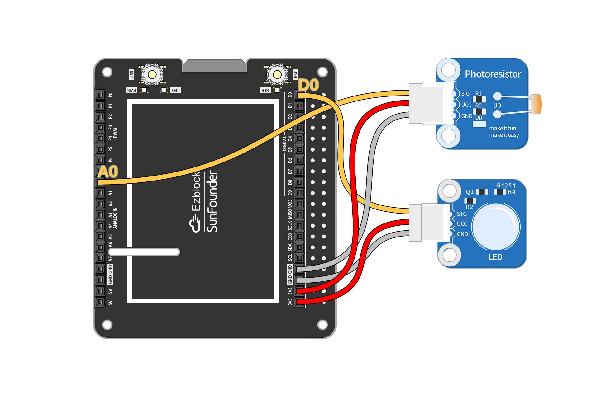

Usage:  
1. Flash the code
2. Simulate the "twilight" lighting environment.
3. Change the threshold to the current photoresistor value.
4. Reflash the code

--------------------------------------
## Sound Lamp
In this example, you will create a voice-activated light using a sound sensor. The light will turn on automatically when there is enough sound. Connecting this light to the Internet allows us to turn off the light remotely at the touch of a button on the IoT interface.

The circuit is built as follows:    
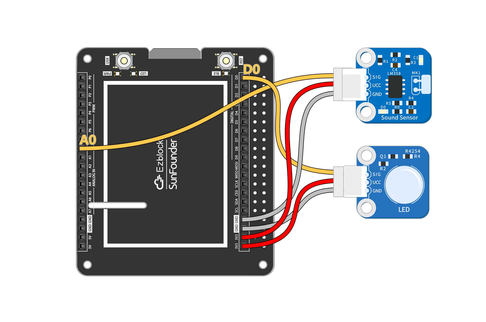

The IoT control is shown below:   
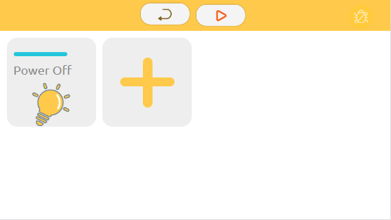

Usage:
1. Modify Wifi Configuration
2. Flash the code
3. Run IoT

--------------------------------------------------------------

## Noisy
In this example, you will record the sound sensor readings in a line graph. You can see from the line chart when your living environment is the noisiest.

The circuit is built as follows:    
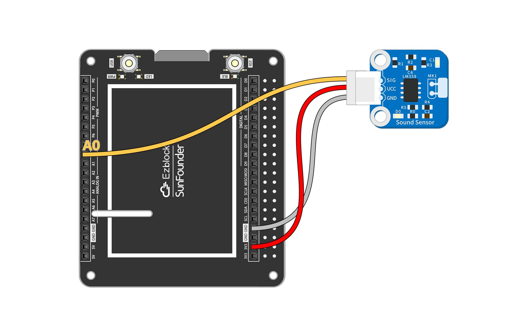

The remote controls are as follows: 
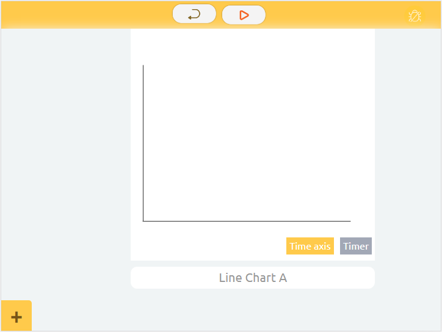

Usage:  
1. Flash the code
2. Run remote control
3. Perform noise testing
4. View Line Chart
-----------------------------------------------------------

## Theremin Organ
The Theremin is the only electronic instrument in the world that does not require physical contact to play. Let's use ultrasonic sensors to make an instrument that also doesn't require physical contact!

The circuit is built as follows:  
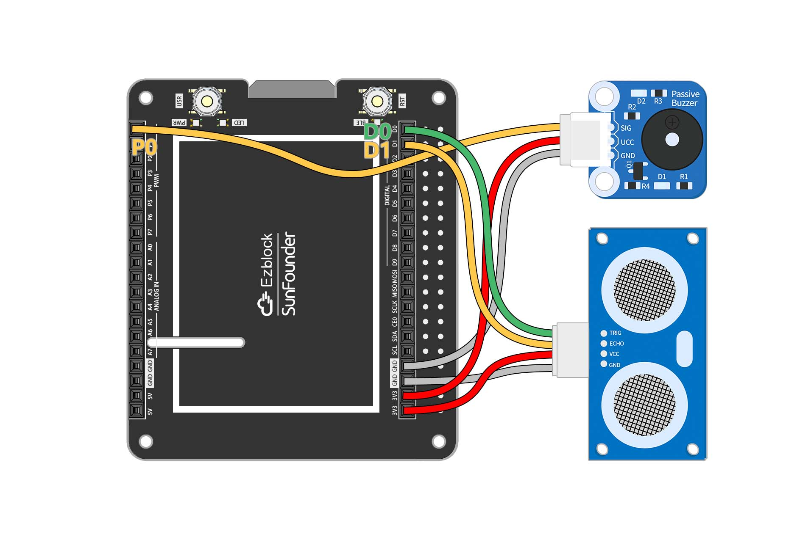

Usage:
1. Flash the code
2. Place your hand directly in front of the ultrasonic sensor
3. Play by swinging the hand to different distances

----------------------------------------------------------
## Magic Wand
Let's make a magic wand. Tie the RGB module and tilt switch to a small stick. Wave the stick and the light will change to different colors.

The circuit is built as follows:  
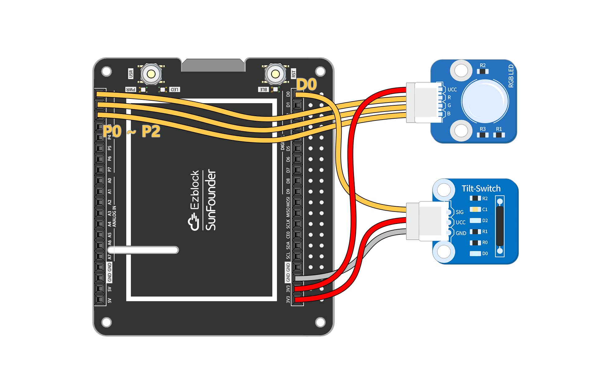

Usage:
1. Flash the code
2. Wave tilt switch

-------------------------------------------------------------
## Hot Weather Alarm
Monitor the temperature with the DS18B20! The real-time temperature of the room is seen in the Iot interface. The circuit is also connected to an RGB light that glows red when it is hot, blue when it is cold, and green when it is comfortable. You can test the temperature experiment with a cold water bottle or with warm hands.

The circuit is built as follows:  
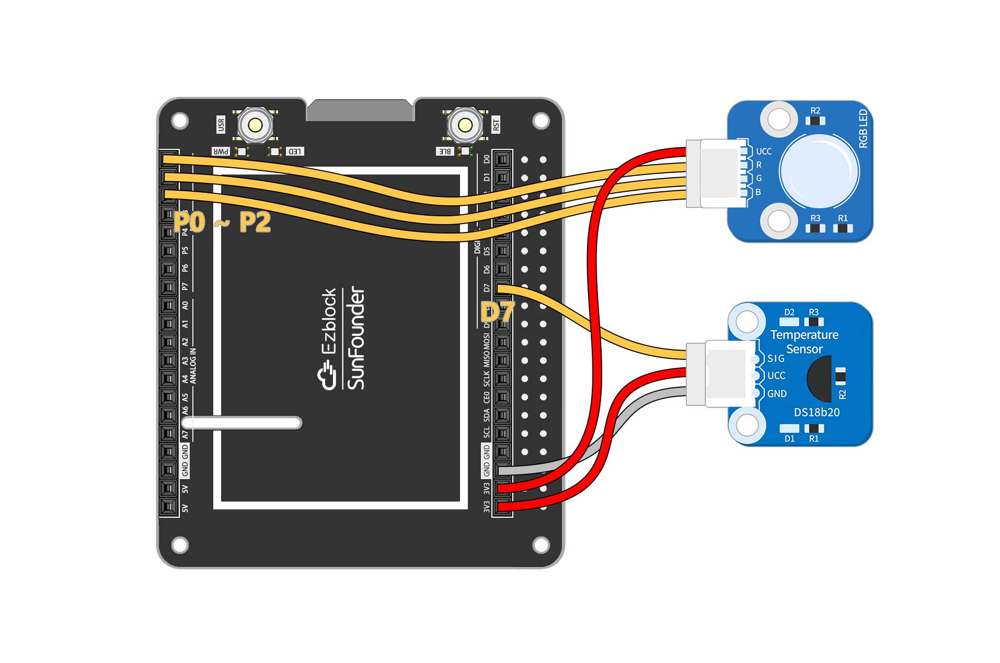

Usage:
1. Flash the code
2. Run IoT
---------------------------------------
## Swaying Rainbow
Control the color of the RGB LEDs with the acceleration in the three axis directions of ADXL345. What happens? When you wave the ADXL345 at will, the RGB LEDs will change color. When you wave the ADXL345 and the RGB LED together, a rainbow of colors appears!

The circuit is built as follows:    
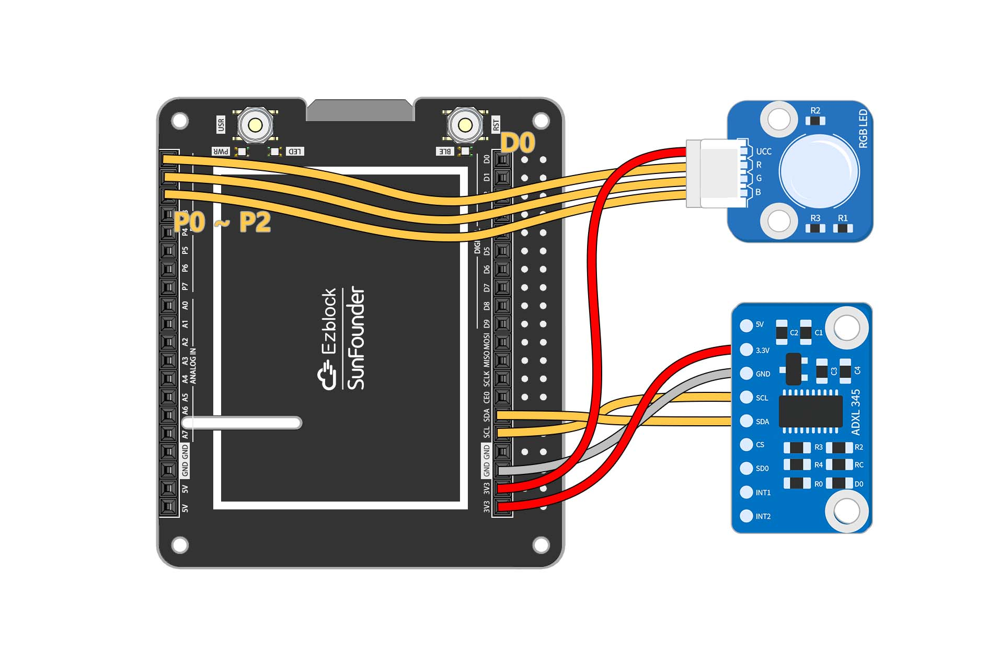

Usage:
1. Flash the code
2. Play!

-------------------------------------
## Smart Garage Door
Let's build a smart garage system where we press button in the IoT interface, the garage door (controlled by servo) will open and the ultrasonic sensor will sense the car's position. When the car is far away, the garage door will close automatically.

The circuit is built as follows:    
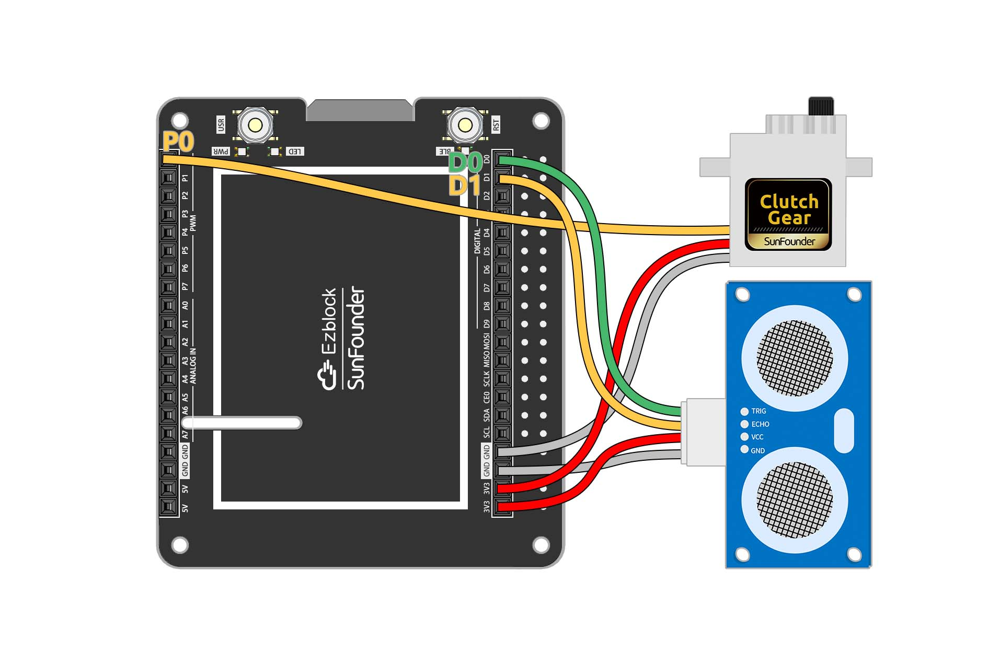

The IoT control is shown below: 
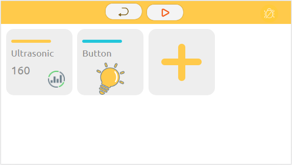

Usage:
1. Modify Wifi Configuration 
2. Flash the code
3. Run IoT

-------------------------------------
## Count 100
Make a little game with button and digital display! The numbers will increase rapidly, so you have to press the button when the number reaches 100, and if the pinch is successful, You Win!

The circuit is built as follows:    
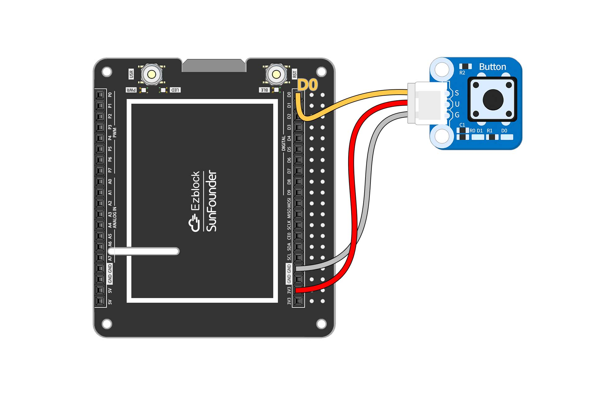

The remote controls are as follows: 
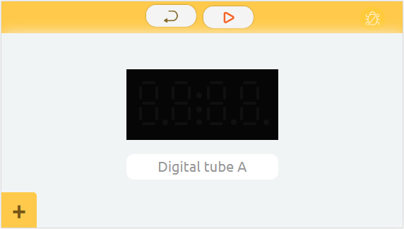

Usage:
1. Flash the code
2. Run remote control
3. Play

-----------------------------
## Plant Monitoring
Make a monitor for your potted plant! With IoT, you can use photoresistor and moisture module to know the current growing environment of your plants even when you are not at home, and to give them additional light.

The circuit is built as follows:    
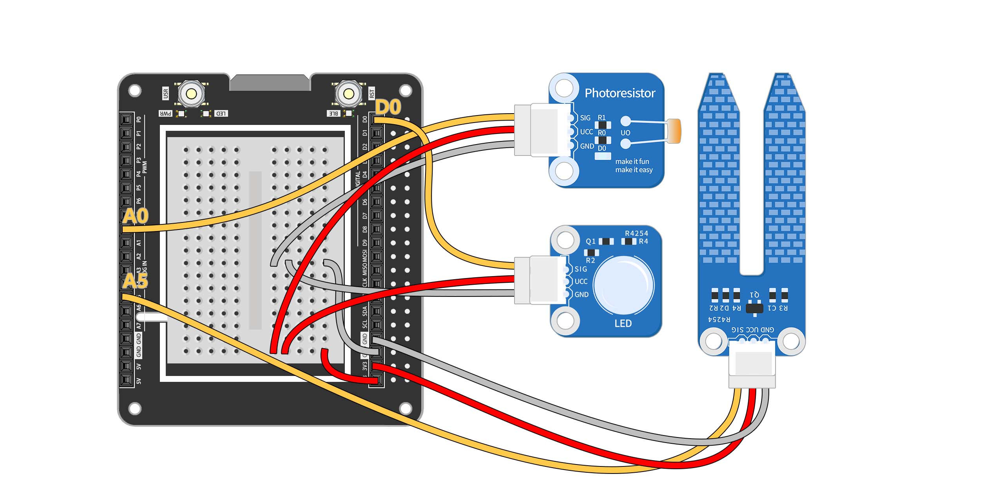

The IoT control is shown below: 
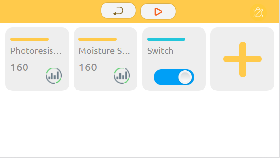

Usage:
1. Modify Wifi Configuration 
2. Flash the code
3. Run IoT