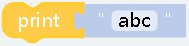
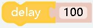

# Basic

##   
- **effect：** The block placed in Start will only be executed once, which is suitable for some initialization operations in the block
***
    

##   
- **effect：** The content in the block will loop indefinitely
***

    

## 
- **effect：** The corresponding content can be output to the console, which can be used for debugging
- **parameter：** `"abc"` is what you want to output, it can be any type
***

## 
- **effect：** Delay a certain time，Set duration for operation
- **parameter：** `"100"` Can only be a number type, in milliseconds
***
