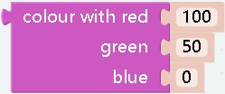
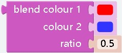

# Colour

## Prologue
`Colour` can only be used with some special modules, such as rgb 
modules
***

## 
- **effect：** Variable for outputting a colorm,computer-based color
***

## 
- **effect：** Variable for outputting a colorm,Based on the colors that the rgb module can output
***

## 
- **effect：** The color is composed of three colors of r, g, and b according to a certain ratio. This block can read the ratio of r, g, and b of the color value
***

## 
- **effect：** Get random colors
***

## 
- **effect：** Create a color according to the custom r, g, b ratio
- **parameter：** The rgb value of ezblock is different from the normal rgb value. Normally, it is 0~255, but the chromaticity in ezblock is 0~100 (this is also the range of the parameter)
***

## 
- **effect：** You can mix two colors in a certain ratio
- **parameter：** The parameter can only be a decimal (fraction) less than 1, which will be allocated to `colour2` and the rest will be allocated to `colour1`. For example, if the parameter is 0.4, then the colors will be mixed in the ratio of `colour1`0.6,`colour2`0.4
***

