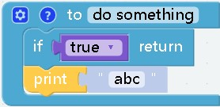
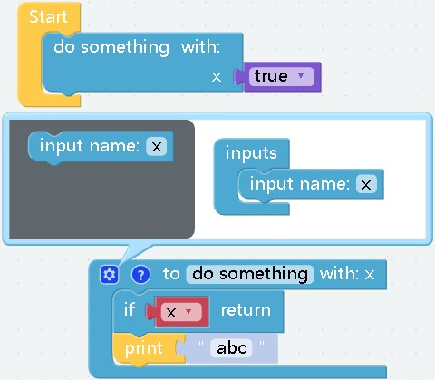

# Functions


## 
- **effect：** Create a function with no return value
***

## 
- **effect：** Create a function with a return value
***

## 
- **effect：** When certain conditions are met, the function will be terminated and subsequent statements will not be executed
***

## 
- **effect：** Call a function you created and execute its contents
***

## 
- **effect：** Optional when creating a function. Click the gear in the upper left corner of the function block to configure the parameters. The transmitted parameters can be used directly inside the function
__computational results:__
    ```
    ```
***