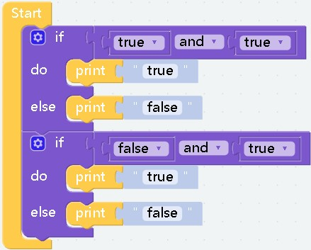
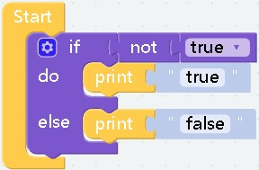
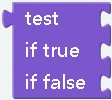
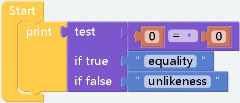

# Logic

##   
- **effect：** Used to capture changes in variables to respond When the condition is met, that is, when the parameter value is true, the content of the block will be executed 
    
***

##   
- **effect：** Compare the left and right parameters, return a Boolean value, return true if the condition is met, otherwise return false
- **parameter：** The value type on the left and right sides must be the same, for example, both are numbers or both are characters

***

##   
- **effect：** It will return a Boolean value, and the parameters on both sides must also be Boolean values. __If both sides are true__, return __`true`__. __If either party is false or both parties are false__, return __`false`__.
##   
- **effect：** Returns a boolean value, the parameters on both sides must also be boolean values, __as long as either of them is `true`__, it will return `true`, __and only when both are `fasle`__ will it return `false`  
  
computational results:
    ```
        true
        false
    ```

***

##   
- **effect：** Splicing before the block whose return value is Boolean will get the __opposite Boolean value__  
  
computational results:
    ```
        false
    ```
***

##   
- **effect：** That is, the boolean value `true`.
##   
- **effect：** That is, the boolean value `false`.
***

##   
- **effect：** Generally used to compare or assign values to variables
***

##   
##   
- **effect：** In fact, it has the same function as the `true` block and the `false` block. They are all boolean values, but this block is more suitable for switch state assignment.
***

##   
- **effect：** This is a ternary expression, if the return value of `test` is `true` then the block after `if true` will be executed, and vice versa
- **example：**  
  
computational results:
    ```
        equality
    ```
***