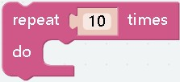
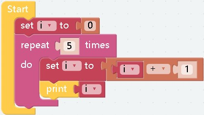
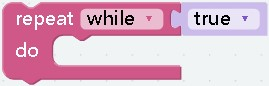
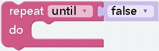
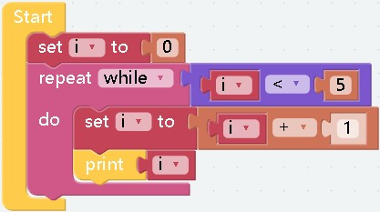
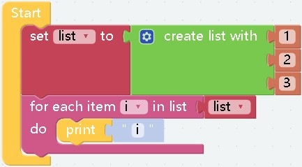
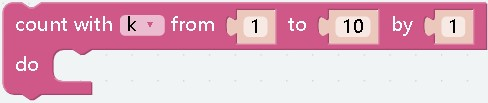
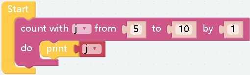
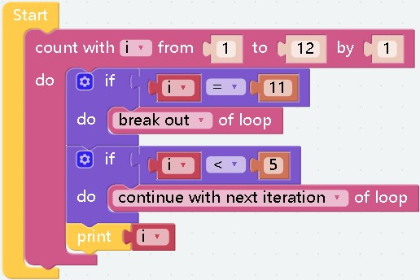

# loops

##   
- **effect：** The code in the block will be executed a certain number of times
- **parameter：** The parameter must be an integer, used to specify the number of cycles
- **example：**  
  
computational results:
    ```
        1
        2
        3
        4
        5
    ```
***

##  
##  
- **effect：** When the conditions are met, the content in the block will be executed repeatedly
- **parameter：** 
__while：__ The type of the parameter is Boolean. When the value of the parameter is __`true`__, it will enter the loop.
__until：__ The type of the parameter is Boolean. When the value of the parameter is __`false`__, it will enter the loop.
- **example：**  
  
computational results:
    ```
        1
        2
        3
        4
        5
    ```
    ***If it is `until` then nothing will be output***
***

##  
- **effect：** Read the specified list from the subscript [0] in order
- **parameter：** The parameter can only be a value of type list
- **example：**  
  
computational results:
    ```
        1
        2
        3
    ```
***

##  
- **effect：** Set the start number and increment number on the basis of `repeat 10 times`
- **parameter：** The parameters can only be integers. During the loop, the current subscript value will be assigned to `j`, `5` means starting number, `10` means ending number, `2` means increasing number, and in non-special cases, second Parameter is not greater than the third parameter
- **example：**  
  
computational results:
    ```
        5
        6
        7
        8
        9
        10
    ```
***
##  
- **effect：** `Break` and `countinue` can only be used in a loop block. The execution of `break` in a loop block will terminate the entire loop. If `countinue` is executed, it will jump out of this loop and start the next loop.  

computational results:
```
    5
    6
    7
    8
    9
    10
```
***