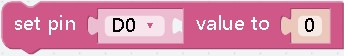

Pin
===
## 
- **effect:** pin object
***

## 
- **effect:** pin objects of buttons and led lights on the expansion board
***

## 
- **effect:** Set the mode of the pin to output or input,Set the mode of the pin to output or input, for example, the led light is output, and the button is input
***

## 
- **effect:** Get the status of the specified pin will return 0 or 1
***

## 
- **effect:** Setting the pin to off means setting the value of the pin to 0
***

## 
- **effect:** Setting the pin to on means setting the value of the pin to 1
***

## 
- **effect:** Set the state of the pin, the parameter can only be 0 or 1
***

