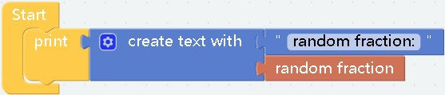
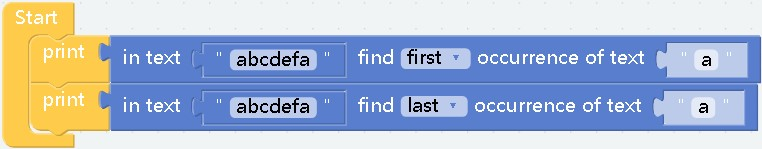

# basic

##  
- **effect：** String value, generally used for assignment or judgment
***


## 
- **effect：**  Used to concatenate strings  
- **parameter：** The number of parameters can be any number, the parameters can also be any type, but they will all be converted to string  
- **example：**  
  
computational results:
    ```
        0.14
    ```
***

## 
- **effect：** Concatenated string
- **parameter：** the parameters can be any type, but they will all be converted to string
***

## 
- **effect：** Returns the length of the string, the return value of int type
*** 

## 
## 
- **effect：** Check whether there is a corresponding character in the character, and return the position, if not, return 0  
You can set to return the position of the first character found, or return the position of the last character

- **parameter：** Both parameters are of string type, the first parameter is the main string, and the second parameter represents the character to be found in the first parameter
- **example：**  
  
computational results:
    ```
        1
        7
    ```
***

## 
- **effect：** Get the string at the specified position in the text
***

## 
- **effect：** Get the characters between the specified subscripts in the text
***

## 
- **effect：** don't say so much
***

## 
- **effect：** Needless to say
***
